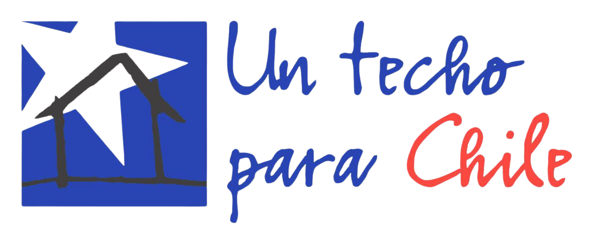

<p align="center">
  
</p>

<h1 align="center">Techos Para Chile</h1>

<p align="center">
  Sistema de gestión operacional para coordinación de voluntarios, materiales y donaciones en terreno.
</p>

---

## Descripción

Sistema de gestión operacional para **Techos Para Chile**, organización que coordina cuadrillas de voluntarios en proyectos de construcción social. Centraliza la gestión de stock de materiales, inscripción de voluntarios, autenticación por roles, registro de donaciones y asignación de cuadrillas.

Es una app monolítica: Express sirve tanto la API (`/api/*`) como el frontend estático (`public/`) desde el mismo proceso y puerto.

---

## Stack

| Capa | Tecnología |
|---|---|
| Runtime | Node.js 18+ |
| Framework | Express 4.x |
| ORM | TypeORM |
| Base de datos | PostgreSQL 16 |
| Autenticación | JWT + bcrypt |
| Validación | express-validator |
| Frontend | HTML/CSS/JS vanilla (`public/`), servido como estático por Express |

---

## Avance actual

- ✅ Entidades creadas desde el MER
- ✅ Servicios, controladores y rutas implementados
- ✅ Autenticación JWT + bcrypt con permisos por rol
- ✅ Seed automático con datos de prueba
- ✅ Base de datos conectada y tablas sincronizadas

---

## Requisitos

- Node.js 18 o superior
- PostgreSQL 16
- npm 9+

---

## Instalación

```bash
git clone https://github.com/Matutii/Proyecto-Techos-para-Chile-.git
cd Proyecto-Techos-para-Chile-
npm install
cp .env.example .env
# Editar .env con tus credenciales de BD
npm run dev
```

La app completa (API + frontend) queda disponible en `http://localhost:3000`.

---

## Variables de entorno

```env
PORT=3000
HOST=localhost
NODE_ENV=development

DB_PORT=5432
DB_USERNAME=postgres
PASSWORD=tu_password
DATABASE=techos_para_chile

JWT_SECRET=tu_clave_secreta_minimo_32_caracteres
JWT_EXPIRES_IN=8h
```

---

## Usuarios de prueba

El seed crea automáticamente estos usuarios al iniciar la app:

| Email | Contraseña | Rol |
|---|---|---|
| admin@techos.cl | Admin1234 | admin |
| bodega@techos.cl | Admin1234 | coordinador_logistica |

Además, cualquiera puede crear una cuenta propia con rol `visitante` desde `POST /api/auth/registro` (o el tab "Crear cuenta" del frontend). Los roles `colaborador` y `encargado_cuadrillas` los crea un admin desde el panel de Usuarios.

---

## API Endpoints

### Autenticación — `/api/auth`

| Método | Ruta | Auth | Descripción |
|--------|------|------|-------------|
| POST | `/login` | ❌ | Iniciar sesión |
| POST | `/registro` | ❌ | Crear cuenta pública con rol `visitante` |
| GET | `/perfil` | ✅ | Obtener perfil del usuario autenticado |

### Usuarios — `/api/usuarios` (solo admin)

| Método | Ruta | Descripción |
|--------|------|-------------|
| GET | `/` | Listar usuarios |
| POST | `/` | Crear cuenta con rol específico |
| PATCH | `/:id` | Cambiar rol y/o activar/desactivar cuenta |

### Stock — `/api/stock`

| Método | Ruta | Auth | Descripción |
|--------|------|------|-------------|
| GET | `/` | ✅ | Listar materiales (cantidad, umbral, estado calculado) |
| GET | `/proyectos` | ✅ | Vista agrupada por proyecto |
| GET | `/:id` | ✅ | Obtener material + historial |
| POST | `/` | ✅ | Crear material (admin/coordinador) |
| POST | `/:id/entrada` | ✅ | Registrar entrada de stock (admin/coordinador) |
| POST | `/:id/asignar` | ✅ | Asignar material a un proyecto (admin/coordinador) |
| PATCH | `/:id/retiro` | ✅ | Retirar material (admin/coordinador/colaborador) |
| PATCH | `/:id/en-camino` | ✅ | Marcar/desmarcar material en camino (admin/coordinador) |

### Voluntarios — `/api/voluntarios`

| Método | Ruta | Auth | Descripción |
|--------|------|------|-------------|
| POST | `/inscripcion` | ❌ | Inscribir voluntario |
| GET | `/` | ✅ | Listar voluntarios |
| GET | `/:id` | ✅ | Obtener voluntario por ID |

### Donaciones — `/api/donaciones`

| Método | Ruta | Auth | Descripción |
|--------|------|------|-------------|
| GET | `/metodos-pago` | ❌ | Métodos de pago disponibles |
| POST | `/` | opcional | Registrar una donación (si hay token, queda vinculada al usuario) |
| GET | `/` | ✅ | Listar donaciones (admin/coordinador) |
| PATCH | `/:id/estado` | ✅ | Aceptar o rechazar una donación (admin/coordinador) |

### Cuadrillas — `/api/cuadrillas`

| Método | Ruta | Auth | Descripción |
|--------|------|------|-------------|
| GET | `/` | ✅ | Listar cuadrillas |
| GET | `/:id` | ✅ | Obtener cuadrilla + integrantes |
| POST | `/` | ✅ | Crear cuadrilla (admin/coordinador/encargado_cuadrillas) |
| PUT | `/:id` | ✅ | Actualizar cuadrilla (admin/coordinador/encargado_cuadrillas) |
| DELETE | `/:id` | ✅ | Eliminar cuadrilla (solo admin) |
| POST | `/:id/voluntarios` | ✅ | Agregar voluntario a cuadrilla |

### Proyectos — `/api/proyectos`

| Método | Ruta | Auth | Descripción |
|--------|------|------|-------------|
| GET | `/` | ✅ | Listar proyectos |

---

### Health

| Método | Ruta | Descripción |
|--------|------|-------------|
| GET | `/api/health` | Verificar servidor activo |

---

## Licencia

Proyecto académico — Metodología del Desarrollo.
